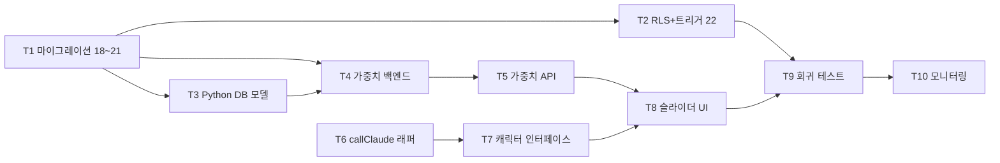

# 🟦 M1 — 인프라 구축 작업 계획서

> **마일스톤**: M1 (인프라)
> **목표**: 기존 7단계 파이프라인을 *건드리지 않고*, 8명 캐릭터 시스템의 토대만 만든다.
> **선결 조건**: `CURRENT-STATE.md` 분석 결과 ✅ M1 시작 가능 확인됨.
> **원칙**: Strangler Fig — 옆에 추가, 기존 미수정.

---

## 0. 작업 묶음 개요

| Task | 항목 | 예상 소요 | 의존성 |
|:---:|---|---:|---|
| **T1** | Supabase 마이그레이션 18~21 (신규 8개 테이블) | 3h | — |
| **T2** | RLS 정책 + 트리거 (마이그레이션 22) | 2h | T1 |
| **T3** | Python 측 8명 시스템 DB 모델 (`agents/db/`) | 2h | T1 |
| **T4** | 가중치 시스템 백엔드 (검증 + 정규화) | 3h | T1, T3 |
| **T5** | TypeScript 측 가중치 API 라우트 | 2h | T4 |
| **T6** | `callClaude` 래퍼 (`apps/web/lib/agents/llm.ts`) | 2h | — |
| **T7** | 캐릭터 출력 표준 인터페이스 (TS 타입 + Zod) | 1.5h | T6 |
| **T8** | 가중치 슬라이더 UI 페이지 (`/admin/agent-weights`) | 3h | T5 |
| **T9** | 회귀 테스트 + 검증 스크립트 | 2h | T1~T8 |
| **T10** | M2 진입 전 1주 운영 모니터링 셋업 | 1h | T9 |

**총 예상**: ~21.5시간. 하루 2-3시간씩 작업하면 1.5~2주.

---

## 1. 의존성 그래프



**병행 가능**: T6 (callClaude 래퍼)는 T1~T5와 무관 — 다른 시간대에 작업 가능.

---

## 2. T1 — Supabase 마이그레이션 (신규 8개 테이블)

### 작업 항목

- [ ] `supabase/migrations/00000000000018_agent_outputs.sql`
  - 테이블: `agent_outputs`
  - 컬럼: `id (uuid pk)`, `created_at`, `agent_name (enum: soros|taleb|simons|graham|dow|shiller|keynes|turing)`, `cycle_at (timestamptz)`, `ticker`, `score (numeric -2~+2)`, `severity (smallint, taleb only)`, `narrative (text)`, `raw_payload (jsonb)`
  - 인덱스: `(agent_name, cycle_at desc)`, `(ticker, cycle_at desc)`

- [ ] `supabase/migrations/00000000000019_signals_and_briefings.sql`
  - 테이블 3개:
    - `final_signals` — Soros 최종 시그널 (ticker, signal_grade, confidence, narrative, weights_snapshot jsonb, created_at)
    - `signal_change_events` — 시그널 변경 이력 (from_grade, to_grade, reason, taleb_override boolean)
    - `daily_briefings` — 일일 브리프 카드 (date, summary_md, top_stocks jsonb)

- [ ] `supabase/migrations/00000000000020_weights_v2.sql`
  - 기존 `_seed_weight_config.sql`(08)과 *별개*인 8명 시스템 전용:
    - `user_weight_settings` — user_id, weights jsonb (`{simons: 0.20, graham: 0.18, ...}`), updated_at
    - `weight_settings_history` — 변경 이력 (before/after jsonb)
    - `soros_weight_adjustments` — Soros 임시 ±50% 조정 (사용자 가중치는 그대로, 즉석 오버레이만)

- [ ] `supabase/migrations/00000000000021_agent_knowledge.sql`
  - 테이블: `agent_knowledge` — agent_name, knowledge_type (lesson|pattern|self_critique), content_md, source_signal_id (fk → final_signals), confidence_at_time, outcome_observed, created_at
  - M8 강화 학습이 누적할 공간 — M1에서는 스키마만 잡아둠

### 검증

```bash
# 적용
supabase db push   # 또는 migrate.yml workflow

# 확인
supabase db diff   # 충돌 없어야 함
psql ... -c "\dt" | grep -E "agent_|final_signals|user_weight_settings"
```

검증 통과 기준: 8개 신규 테이블이 전부 존재 + 기존 17개 테이블 영향 없음.

---

## 3. T2 — RLS 정책 + 트리거 (마이그레이션 22)

### 작업 항목

- [ ] `supabase/migrations/00000000000022_agent_rls.sql`
  - **모든 8개 신규 테이블에 RLS 적용** (CLAUDE.md §3-E 필수)
  - 정책:
    ```
    agent_outputs: SELECT public read for authenticated, INSERT/UPDATE service_role only
    final_signals: SELECT for authenticated (own + admin all), INSERT service_role only
    signal_change_events: SELECT public read, INSERT service_role only
    daily_briefings: SELECT public read, INSERT service_role only
    user_weight_settings: SELECT/UPDATE owner only (auth.uid() = user_id)
    weight_settings_history: SELECT owner only, INSERT service_role only
    soros_weight_adjustments: SELECT public read, INSERT service_role only
    agent_knowledge: SELECT for authenticated (read), INSERT service_role only
    ```
  - 트리거: `user_weight_settings.updated_at` 자동 갱신

### 검증

- [ ] anon client로 `INSERT INTO agent_outputs` → 거부됨
- [ ] anon client로 다른 사용자의 `user_weight_settings` SELECT → 거부됨
- [ ] service_role client로 위 모두 → 통과

검증 통과 기준: 비밀 데이터(가중치)는 본인만, 시그널은 누구나 읽을 수 있고 쓰기는 백엔드만.

---

## 4. T3 — Python 측 DB 모델 (`agents/`)

### 작업 항목

> **Strangler 준수**: 기존 `db/`, `cognition/`, `signals/` 등 절대 수정 금지. **새 패키지 `agents/` 신설**.

- [ ] `agents/__init__.py` — `"""8-agent character system. Lives alongside legacy 7-step pipeline."""`
- [ ] `agents/db/__init__.py`
- [ ] `agents/db/models.py` — Pydantic v2 모델 (`AgentOutput`, `FinalSignal`, `DailyBriefing`, `UserWeightSettings`, ...)
- [ ] `agents/db/repository.py` — 8개 테이블 CRUD wrapper. 기존 `db.supabase_client.get_admin_client()` 재사용 (변경 없음)
- [ ] `agents/db/migrations_check.py` — 신규 18~22 마이그레이션 적용 상태 검증 스크립트

### 검증

```bash
python -m agents.db.migrations_check   # 모든 신규 테이블 존재 + 컬럼 일치 확인
pytest tests/agents/db/ -q             # 새 테스트 디렉토리 (T9에서 작성)
```

---

## 5. T4 — 가중치 시스템 백엔드 (Python)

### 작업 항목

- [ ] `agents/weights/__init__.py`
- [ ] `agents/weights/constants.py`
  ```python
  AGENT_NAMES = ('simons', 'graham', 'dow', 'shiller', 'keynes', 'taleb')
  DEFAULT_WEIGHTS = {'simons': 0.20, 'graham': 0.18, 'dow': 0.18, 'shiller': 0.13, 'keynes': 0.18, 'taleb': 0.13}
  MIN_WEIGHT = 0.05  # 5%
  MAX_WEIGHT = 0.40  # 40%
  TALEB_MIN = 0.10   # 강제 최소
  ```
- [ ] `agents/weights/validator.py`
  - `validate_user_weights(weights: dict) -> ValidatedWeights` — 5~40% 검증, Taleb 10% 보장, 합계 1.0 정규화
  - 위반 시 `WeightConstraintError(field, message)` raise
- [ ] `agents/weights/normalizer.py` — 합계 자동 보정 (사용자가 1.0 못 맞춰도 비례 정규화)
- [ ] `agents/weights/adjustments.py` — Soros ±50% 임시 오버레이 (M1에선 함수 시그니처만, 호출은 M2)

### 검증

```python
# 단위 테스트
test_validator_rejects_below_min()        # graham=0.03 → ConstraintError
test_validator_rejects_above_max()        # simons=0.50 → ConstraintError
test_validator_enforces_taleb_min()       # taleb=0.05 → ConstraintError
test_normalizer_handles_uneven_sum()      # 합 0.95 → 비례 1.0 정규화
test_soros_overlay_within_bounds()        # ±50% 후에도 5~40% 유지
```

검증 통과 기준: 위 5개 단위 테스트 모두 pass.

---

## 6. T5 — TypeScript 측 가중치 API 라우트

### 작업 항목

- [ ] `apps/web/app/api/agents/weights/route.ts`
  - GET: 현재 사용자 가중치 반환 (없으면 DEFAULT_WEIGHTS)
  - PUT: zod 검증 → DB upsert + history insert
  - DEV_BYPASS_AUTH 호환

- [ ] `apps/web/lib/agents/weights.ts` — 클라이언트 헬퍼 (zod 스키마 공유, validate, normalize)

### 검증

```bash
curl http://localhost:3000/api/agents/weights | jq '.'   # 200 + 기본값 또는 사용자 값
curl -X PUT http://localhost:3000/api/agents/weights \
     -H "Content-Type: application/json" \
     -d '{"simons":0.20,"graham":0.18,"dow":0.18,"shiller":0.13,"keynes":0.18,"taleb":0.13}'
# 200 + 저장 확인. 0.03 시도 → 400 + 명확한 에러
```

---

## 7. T6 — `callClaude` 래퍼

### 작업 항목

> 기존 `cognition/sentiment.py` `cognition/scorer.py`의 Anthropic 호출은 *그대로 보존*. 8명 시스템용 별도 래퍼.

- [ ] `apps/web/lib/agents/llm.ts` (TS — 즉시 응답이 필요한 라우트용)
- [ ] `agents/llm/__init__.py` (Python — 백엔드 cron용)
- [ ] 두 래퍼 공통 기능:
  - 프롬프트 캐싱(prompt-caching) 활용
  - 출력 sanitization (CLAUDE.md §3-A 금지어 검증 재활용)
  - 에러 핸들링 + 재시도 (tenacity)
  - 토큰 사용량 로깅 → `agent_llm_usage` 테이블 (T1에서 추가 권장)
- [ ] MeetFlow 패턴 참조 (`D:\claud project\meetflow`에 기존 구현 있음)

### 검증

```typescript
const { text, usage } = await callClaude({
  system: "You are Soros...",
  messages: [{ role: 'user', content: 'test' }],
  cacheKey: 'soros-system-v1',
});
// 200ms 이내 응답, usage 로깅됨
```

---

## 8. T7 — 캐릭터 출력 표준 인터페이스

### 작업 항목

- [ ] `apps/web/lib/agents/types.ts` — TS 타입 + zod 스키마
  ```typescript
  AgentOutput {
    agent_name: 'soros' | 'taleb' | ... ;
    score: number;       // -2 ~ +2
    severity?: number;   // taleb only, 1~5
    narrative: string;
    raw_payload: Record<string, unknown>;
    cycle_at: string;
  }
  ```
- [ ] `agents/schemas.py` — Pydantic 미러
- [ ] 점수 환산 공식 검증: `score_to_signal_grade(score, weights) -> 'STRONG_BUY'|'BUY'|'HOLD'|'CAUTION'|'RISK'`

### 검증

- [ ] zod와 Pydantic 스키마 1:1 일치 (자동 동기화 스크립트로 확인)
- [ ] 점수 환산 단위 테스트 (예: 가중 합산 +1.5 → STRONG_BUY)

---

## 9. T8 — 가중치 슬라이더 UI 페이지

### 작업 항목

> 기존 `apps/web/app/(admin)/weights/page.tsx` (7요소 가중치)는 **그대로 보존**. 새 경로에 신설.

- [ ] `apps/web/app/(app)/settings/agent-weights/page.tsx` — 모든 사용자가 자기 가중치 조정 (admin 전용 X)
- [ ] `apps/web/components/agents/weight-slider-form.tsx`
  - Radix Slider 6개 (Simons/Graham/Dow/Shiller/Keynes/Taleb)
  - 실시간 합계 표시 + Taleb 10% 가드
  - 추천 가중치 설명 카드 (system-weight-settings.md 참조)
  - 변경 시 `PUT /api/agents/weights`
- [ ] 사이드바에 "AI 가중치" 메뉴 추가 (`apps/web/components/layout/sidebar.tsx` — 기존 항목 보존하며 추가)

### 검증

- [ ] 수동: 슬라이더 조작 → 즉시 합계 갱신 → 저장 → 새로고침 후 유지
- [ ] 5% 미만 / 40% 초과 시도 시 토스트 에러
- [ ] history 테이블에 변경 이력 1행 누적 확인

---

## 10. T9 — 회귀 테스트 + 검증 스크립트

### 작업 항목

- [ ] `tests/agents/test_db_repository.py` — T3 단위 테스트
- [ ] `tests/agents/test_weights.py` — T4 가중치 검증 5개 케이스
- [ ] `tests/agents/test_llm_wrapper.py` — T6 mock Anthropic 호출
- [ ] `apps/web/__tests__/agents/weights-api.test.ts` — T5 API 라우트
- [ ] **회귀 테스트** (CURRENT-STATE §7):
  - [ ] `npx tsc --noEmit` pass
  - [ ] `pytest -q` pass (기존 테스트도 모두 그린)
  - [ ] `/dashboard` `/watchlist` `/reports` `/stocks/kr` `/realtime` `/admin/weights`(기존 7요소) 모두 정상 렌더
  - [ ] 일일 파이프라인(cron) 정상 작동 확인 — `.github/workflows/daily-pipeline.yml` 1회 수동 트리거

### 검증 통과 기준

```
✅ 모든 신규 단위 테스트 pass
✅ 기존 테스트 회귀 0건
✅ 6개 핵심 페이지 정상 렌더 (Vercel preview에서 확인)
✅ 일일 파이프라인 다운 0회 (T1 적용 후 1주 관찰)
```

---

## 11. T10 — M2 진입 전 모니터링 셋업

### 작업 항목

- [ ] `agents/observability/` 폴더 신설
- [ ] LLM 비용 추적 (M2에서 폭증 위험) — Anthropic usage API 폴링 cron
- [ ] 가중치 변경 빈도 대시보드 (Grafana 또는 간단한 `/admin/agent-monitoring` 페이지)
- [ ] Slack 또는 Telegram에 *일일 카운터* 알림 (호출 수, 토큰, 가중치 변경 수)

### 검증 통과 기준

- [ ] 1주일 운영 중 비용 모니터링 대시보드에서 *어떤 캐릭터가 얼마 썼는지* 확인 가능
- [ ] 비용 임계값 (예: 일 5만원) 초과 시 자동 알림

---

## 12. M1 완성 기준 종합

`system-implementation-roadmap.md` §M1의 완성 기준 매핑:

| 로드맵 기준 | 본 계획서 Task |
|---|---|
| ✅ 모든 신규 테이블 생성 + RLS | T1, T2 |
| ✅ 가중치 설정 API 작동 | T4, T5 |
| ✅ callClaude 더미 호출 성공 | T6 |
| ✅ 기존 운영 시스템 100% 정상 (회귀) | T9 |
| ✅ 신규 테이블 직접 INSERT/UPDATE/DELETE | T2, T3 |
| ✅ 가중치 제약 위반 시 명확 에러 | T4 |
| ✅ 베이영님이 슬라이더 조작 가능 | T8 |
| ✅ DB에 변경 이력 정상 기록 | T1 (history 테이블), T8 |

**M2 진입 조건** (로드맵 그대로):
- [ ] 위 8개 기준 모두 통과
- [ ] T1~T9 적용 후 **1주일 운영 중 기존 시스템 다운 0회**

---

## 13. 배포 / 롤백 전략

- 각 Task 단위로 별도 commit (M1-T1, M1-T2, ...)
- Vercel git 자동 배포 활성화됨 → 푸시 즉시 preview 갱신
- DB 마이그레이션은 **새 파일 추가만**, 기존 17개 절대 수정 금지
- 롤백 필요 시: 신규 마이그레이션 18~22를 역순으로 DROP TABLE — 기존 시스템 전혀 영향 없음

---

## 14. 미해결 항목 (M1 시작 전 결정 필요)

- [ ] **`agents/` 패키지를 `pyproject.toml` `packages.find.include`에 추가할지** — 추가하면 GitHub Actions에서 import 가능. M1에서는 추가 필요 (T3에서 사용).
- [ ] **TS-Python 스키마 동기화 도구** — pydantic2zod 자동? 또는 수동? M1은 작은 스키마만 → 수동 OK.
- [ ] **사이드바에서 "AI 가중치" 메뉴 위치** — `/settings` 그룹 안 vs 새 `/agents` 그룹? → `/settings/agent-weights` 권장 (사용자 개인 설정).
- [ ] **LLM 비용 임계값 구체 숫자** — 일 5만원? 월 30만원? T10에서 사용자 합의 후 결정.

---

## 15. 첫 번째 작업 추천 → 다음 섹션 참조

본 문서 끝 `🎯 첫 작업 추천` 참조.
