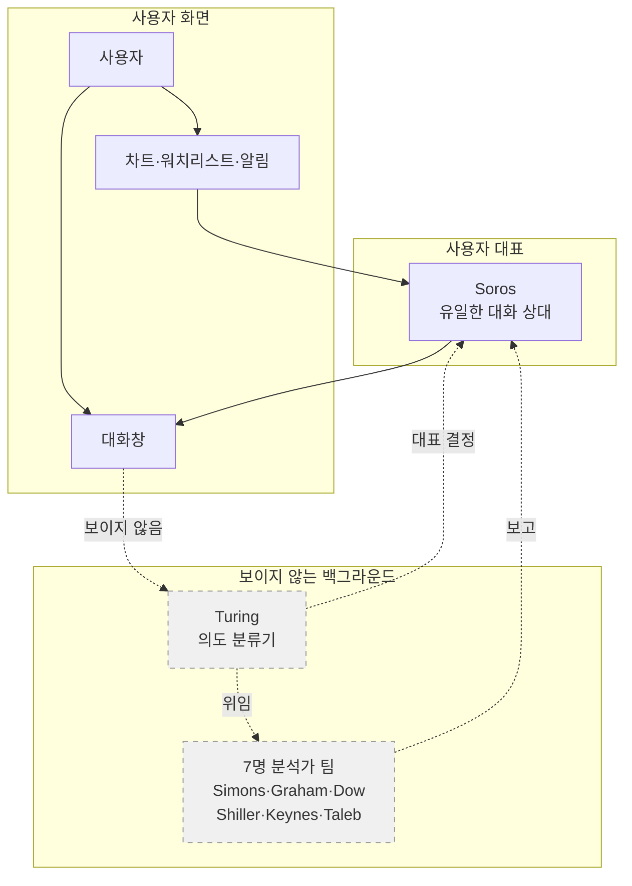
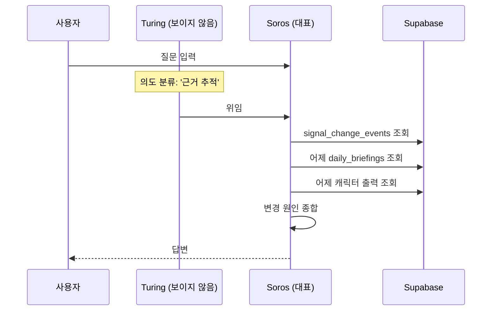
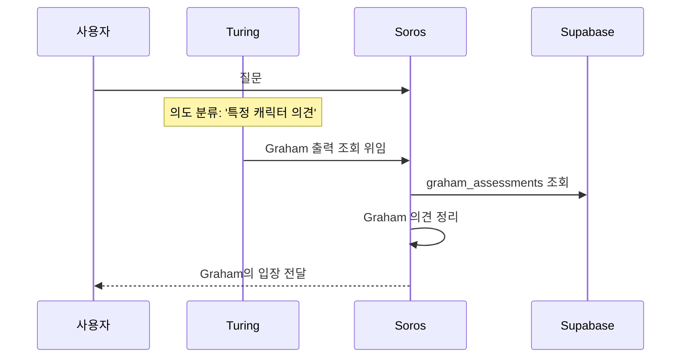
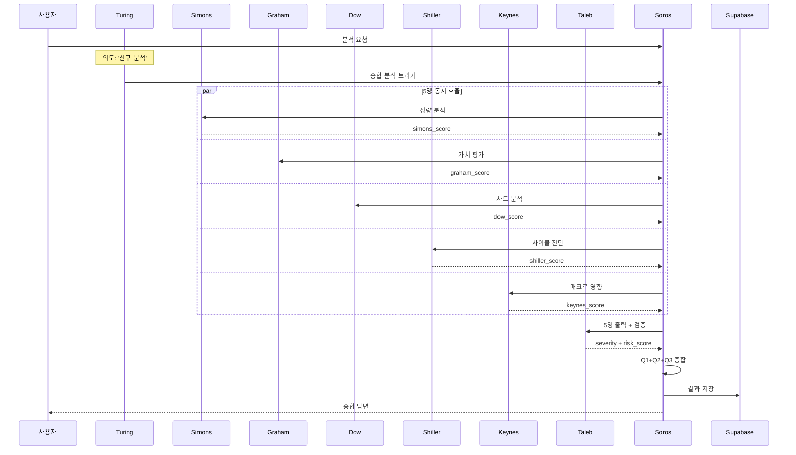
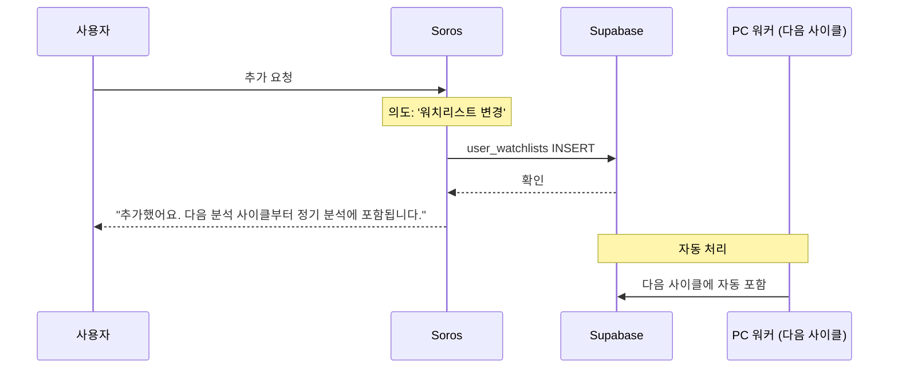
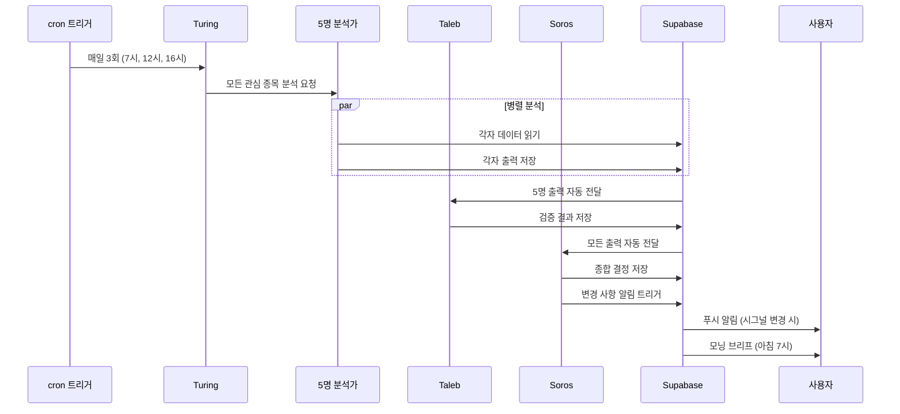
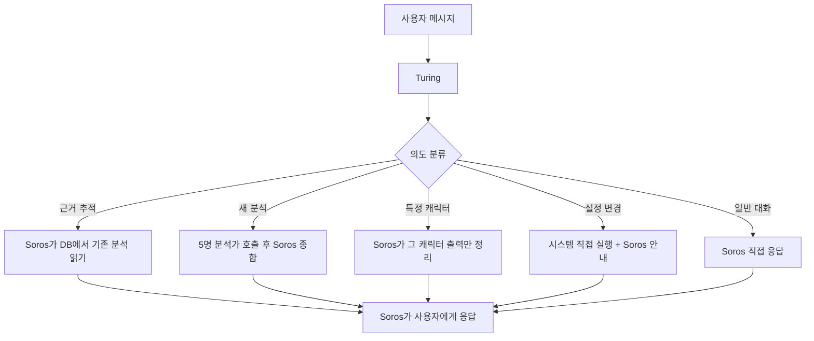
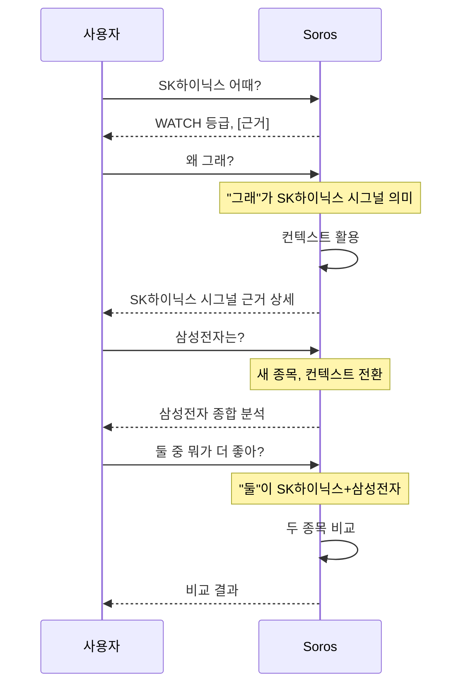
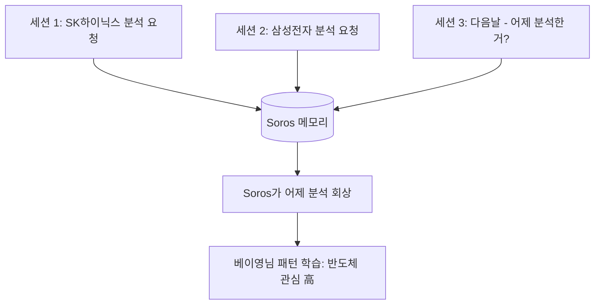

# 🗣️ 호출 흐름 정의서

> **QuantSignal 시스템 통합 정의서 v1.0**
> 사용자가 시스템과 상호작용하는 모든 흐름을 정의.
> **핵심 원칙: 사용자는 Soros 한 명과만 대화한다.**

---

## 0. 설계 원칙

1. **단일 페르소나 정책** — 사용자에게는 Soros만 보임. 다른 캐릭터들은 Soros 뒤에서 일함
2. **대화는 보조** — 메인 UX는 차트·워치리스트·알림. 대화는 *근거 캐묻기*와 *설정 변경*
3. **빠른 응답 우선** — 8명 모두 호출하지 않아도 답할 수 있으면 빠르게
4. **투명한 백그라운드** — 사용자 요청 시 *어느 캐릭터의 의견*인지는 공개 가능

---

## 1. 시스템 아키텍처 (사용자 관점)



**핵심**: 회색 점선 박스는 사용자에게 보이지 않음. 사용자는 *Soros만* 인식.

---

## 2. 대화 시나리오 분류

사용자가 시스템과 대화하는 모든 경우를 4가지로 분류.

| 카테고리 | 빈도 | 처리 방식 |
|---|---|---|
| **A. 근거 캐묻기** | 자주 | Soros가 캐릭터들 의견 종합 후 답변 |
| **B. 분석 요청** | 가끔 | Turing 라우팅 → Soros 정리 |
| **C. 설정 변경** | 드뭄 | 시스템 직접 처리 (Soros 안내만) |
| **D. 탐색·일반** | 가끔 | Soros가 적절한 답변 |

---

## 3. 시나리오 A: 근거 캐묻기 (가장 중요)

베이영님이 *"신뢰를 가지고 거래"* 하려면 *근거 추적*이 가능해야 합니다. 이게 가장 자주 발생하는 대화.

### A-1. 시그널 변경 근거 묻기

**사용자**: "왜 SK하이닉스가 어제 BUY에서 WATCH로 내려갔어?"

**처리 흐름**:



**Soros의 응답 예시**:

> 🎯 *"어제 SK하이닉스 시그널이 BUY → WATCH로 내려간 이유는 다음 세 가지가 동시에 작용했어요:*
> 
> *1. **Taleb이 강한 위험 경고를 발행**했습니다 (severity 4, 메모리 사이클 정점 가능성). 시스템 규칙상 severity 4는 시그널 한 단계 자동 하향이라서요.*
> 
> *2. **Shiller가 반도체 섹터 PE10이 역사적 상위 8%에 진입**했다고 봤습니다. 'AI 거품' 내러티브 강도도 88로 매우 높아진 상태예요.*
> 
> *3. **시장 반영도(priced_in)가 0.82로 상승**했습니다. 좋은 데이터는 이미 가격에 충분히 반영됐다는 뜻이라 신호 강도를 50%로 줄였어요.*
> 
> *Simons와 Dow는 여전히 긍정적이었지만, 위 세 요인이 종합 판단에서 더 큰 비중을 차지했습니다.*
> 
> *[자세한 토론 보기]*"

### A-2. 특정 캐릭터 의견 묻기

**사용자**: "Graham은 SK하이닉스 어떻게 봤어?"

**처리 흐름**:



**Soros의 응답 예시**:

> 🎯 *"Graham은 SK하이닉스에 부정적이었어요.*
> 
> *그가 강조한 점은 다음과 같습니다:*
> 
> *- **본질가치 평가**: PER 기반 132,000원, PBR 기반 145,000원, DCF 기반 128,000원 → 보수적 본질가치 115,000원으로 추정*
> *- **현재가 127,500원** → 안전마진 -10.9% (고평가)*
> *- **품질 점수 78/100** (안정적이지만 가격이 비쌈)*
> 
> *Graham의 표현을 빌리면: '메모리 사이클 회복 기대가 이미 가격에 반영된 것으로 보입니다. 5년 평균 PER 12배를 적용하면 본질가치는 더 낮아집니다. 안전마진 확보를 위해 110,000원 이하 진입을 권합니다.'*
> 
> *다만 다른 캐릭터들은 다른 관점이었어요. Dow는 강한 상승세로 보고 있고, Simons는 정량 모델로 BUY 신호를 냈습니다. 종합적으로 본 제 결론은 [여기]에서 확인하세요."*

### A-3. 견제축 충돌 설명 요청

**사용자**: "Graham이랑 Dow가 의견이 다른데 누가 맞아?"

**Soros의 응답**:

> 🎯 *"좋은 질문이에요. 두 사람은 *원래 자주 다투는 사이*예요.*
> 
> ***Graham (가치 관점)**: PER 18배, 본질가치 대비 -11% → 비싸다*
> ***Dow (추세 관점)**: 200일선 정배열, 강한 상승세 → 추세를 따라가라*
> 
> *둘 다 그 자체로 일리 있어요. 차이는 *시간 축*입니다:*
> 
> *- 가치는 **장기적**으로 작동해요. 1-2년이 걸릴 수도 있고, 그 사이 더 오를 수도 있어요.*
> *- 추세는 **단기적**으로 강해요. 그러나 추세는 언젠가 반전됩니다.*
> 
> *제 종합 판단으로는, 지금이 두 관점이 충돌하는 *위험한 구간*이라고 봅니다. Taleb도 같은 우려를 했고요(severity 4). 그래서 BUY가 아닌 WATCH를 권한 거예요.*
> 
> *역사적으로 비슷한 상황 (가치는 비싼데 추세 강한 시기)의 결과:*
> *- 1999 Q4: 6개월 더 오르고 -65%*
> *- 2017 Q3: 6개월 더 오르고 -10%*
> *- 2021 Q4: 3개월 더 오르고 -25%*
> 
> *어떻게 행동하실지는 베이영님 결정입니다. 단, '둘 다 일리 있다'는 말은 책임 회피가 아니라 *진짜로 그렇다는 사실*을 알려드리는 거예요."*

---

## 4. 시나리오 B: 분석 요청 (가끔)

새 종목이나 추가 분석 요청.

### B-1. 새 종목 분석

**사용자**: "한화솔루션 분석해줘"

**처리 흐름**:



**Soros의 응답 예시**:

> 🎯 *"한화솔루션 종합 분석 결과:*
> 
> ***시그널: WATCH** (관심)*
> ***확신도: 0.65***
> 
> *팀의 의견을 들어보면:*
> 
> *📊 Simons: '관심' (rise_prob 0.61, 신뢰도 0.72) → +1.0점*
> *💎 Graham: '저평가, 매수 검토 가능' (안전마진 +18%) → +1.0점*
> *📈 Dow: '약한 상승세 단계 2' → +0.5점*
> *💭 Shiller: '재생에너지 섹터는 정상 영역' → 0점*
> *🌍 Keynes: '금리 인상기 부담' → -0.5점*
> *🦅 Taleb: 'severity 2, 일상적 위험 수준'*
> 
> *펀더멘털과 가치 측면에서 매력적이지만, 기술적 추세는 약하고 매크로 환경(고금리)이 부담입니다. 강한 BUY로 가기엔 단기 모멘텀이 부족해요.*
> 
> *워치리스트에 추가할까요? [예] [관심없음]*"

### B-2. 포트폴리오 재배분 요청

**사용자**: "내 관심종목 비중 재조정해줘"

**Soros의 응답** (Simons 호출 후):

> 🎯 *"베이영님의 관심 종목 5개에 대한 비중 추천을 정리했어요:*
> 
> *📊 Simons의 포트폴리오 최적화:*
> 
> *- SK하이닉스: 현재 35% → 25% (Taleb 경고 반영)*
> *- 삼성전자: 현재 25% → 30% (안정성 강화)*
> *- LG에너지: 현재 20% → 22%*
> *- 셀트리온: 현재 12% → 13%*
> *- 한화솔루션: 현재 8% → 10%*
> 
> *예상 연간 수익률: +12.4%*
> *예상 변동성: 19.8%*
> *Sharpe ratio: 0.63*
> *95% 신뢰 최대 손실: -16%*
> 
> *주된 변경 이유: Taleb이 SK하이닉스에 severity 4 경고를 냈고, Shiller도 반도체 거품 우려를 표명해서 비중을 낮췄습니다. 그 자리를 안정성 높은 삼성전자로 채웠어요.*
> 
> *적용하시겠어요? [예] [수정] [무시]*"

---

## 5. 시나리오 C: 설정 변경 (드뭄)

대화로 처리하지만 시스템이 직접 실행. Soros는 안내만.

### C-1. 워치리스트 추가

**사용자**: "한화솔루션을 관심 종목에 추가해줘"

**처리 흐름**:



**Soros의 응답**:

> 🎯 *"한화솔루션을 관심 종목에 추가했어요.*
> 
> *다음 분석 사이클(오늘 12시)부터 정기 분석에 포함됩니다. 그때 8명 팀이 매일 3회 분석할 거예요.*
> 
> *지금 바로 분석을 보고 싶으시면 '분석해줘'라고 말씀해주세요."*

### C-2. 가중치 변경

**사용자**: "Taleb의 영향력을 좀 더 키우고 싶어"

**Soros의 응답**:

> 🎯 *"Taleb 가중치 조정을 도와드릴게요.*
> 
> *현재 베이영님의 Taleb 가중치는 0.13입니다. 두 가지 옵션이 있어요:*
> 
> *1. **약간 상향 (0.13 → 0.18)**: 균형 유지하면서 위험 검증 강화*
> *2. **상당 상향 (0.13 → 0.25)**: 보수적 투자자에게 적합*
> 
> *어느 쪽이 좋으세요? 또는 직접 슬라이더로 조정하시려면 [설정 페이지로 이동] 해주세요.*
> 
> *⚠️ 참고: Taleb이 강해지면 매수 시그널이 줄어들 수 있어요. 6개월 정도 운영해보면 어느 가중치가 베이영님께 맞는지 데이터가 쌓입니다."*

### C-3. 알림 설정

**사용자**: "거품 경고만 알림으로 받고 싶어"

**Soros의 응답**:

> 🎯 *"알림을 다음과 같이 변경할게요:*
> 
> ***받을 알림 (선택)**:*
> *- ✓ Shiller 거품 경고 (warning 이상)*
> *- ✓ Taleb 강한 위험 경고 (severity 4+)*
> *- ✗ 일상 시그널 변경*
> *- ✗ 매크로 이벤트 알림*
> *- ✗ 모닝 브리프*
> 
> *이대로 적용할까요? 모닝 브리프는 끄지 않으시는 게 좋아요 (제가 매일 아침 종합 보고를 드리는 시간이거든요)."*

---

## 6. 시나리오 D: 탐색·일반 (가끔)

가벼운 질문이나 시스템 사용.

### D-1. 첫 인사

**사용자가 처음 시스템 진입**

**Soros의 인사**:

> 🎯 *"안녕하세요, 베이영님. 저는 Soros, 베이영님의 데스크 헤드입니다.*
> 
> *제 뒤에는 6명의 전문가 팀과 한 명의 검증자가 있어요. 그들은 매일 3회 베이영님의 관심 종목을 분석하고, 저는 그들의 의견을 종합해 베이영님께 보고합니다.*
> 
> *시작하려면:*
> 
> *1. 화면 상단의 차트와 워치리스트가 메인이에요*
> *2. 궁금한 게 있으면 저에게 물어보세요 ('SK하이닉스 어때?', '왜 이 등급?')*
> *3. 매일 아침 7시에 모닝 브리프를 드릴게요*
> 
> *팀에 대해 더 알고 싶으시면 [팀 소개]를 눌러주세요. 분석 시작할까요?*"

### D-2. 시스템 사용법

**사용자**: "어떻게 쓰는 거야?"

**Soros의 응답**:

> 🎯 *"QuantSignal 사용 방법을 간단히 정리해드릴게요:*
> 
> ***메인 화면 (관제실)***:*
> *- 📊 **차트**: 관심 종목들의 과거-현재-미래 흐름*
> *- 📌 **워치리스트**: 각 종목의 현재 시그널*
> *- 🔔 **알림**: 중요한 변화*
> 
> ***저(Soros)와 대화***:*
> *- "왜 이 등급?" → 근거 설명*
> *- "분석해줘" → 새 종목 분석*
> *- "비중 재조정" → 포트폴리오 추천*
> *- "Graham 의견은?" → 특정 캐릭터 견해*
> 
> ***설정***:*
> *- 가중치 조정 (각 캐릭터의 영향력)*
> *- 알림 설정*
> *- 워치리스트 관리*
> 
> *대부분의 사용은 차트를 보면서, 가끔 저에게 물어보는 식이에요. 저는 항상 여기 있을게요."*

### D-3. 캐릭터 소개 요청

**사용자**: "너희 팀은 어떻게 구성됐어?"

**Soros의 응답**:

> 🎯 *"저희 데스크는 8명입니다:*
> 
> ***저 (Soros) - 데스크 헤드***
> *모든 의견을 종합해 최종 결정. 베이영님과 대화하는 유일한 사람.*
> 
> ***6명 분석가***:*
> 
> *📊 **Simons** - 정량 분석가*
> *ML과 통계로 종목 예측. 사이킷런 GBM 모델 운영.*
> 
> *💎 **Graham** - 가치 분석가*
> *본질가치 계산, 안전마진 평가. 펀더멘털 깊이 봄.*
> 
> *📈 **Dow** - 기술적 분석가*
> *차트와 추세 진단. 거래량으로 추세 검증.*
> 
> *💭 **Shiller** - 시장 사이클 분석가*
> *시장 과열·과침체 탐지. 거품 경고 발행.*
> 
> *🌍 **Keynes** - 매크로 분석가*
> *금리·환율·정책의 섹터별 영향 평가.*
> 
> ***1명 검증자***:*
> 
> *🦅 **Taleb** - 리스크 와처*
> *모든 결정에 반박. severity 4 이상이면 자동 시그널 하향.*
> 
> ***1명 안내자 (보이지 않음)***:*
> 
> *🔀 **Turing** - 베이영님 메시지를 적절한 분석가에게 분배. 사용자에게 보이지 않는 백그라운드 라우터.*
> 
> *시간이 지나며 모두 똑똑해져요. 매주 자기 회고를 하고, 베이영님의 피드백을 학습합니다.*"

---

## 7. 백그라운드 호출 흐름 (사용자에게 보이지 않음)

사용자 화면에는 *Soros만* 보이지만, 뒤에서 일어나는 일.

### 정기 분석 사이클 (사용자 액션 없이도 작동)



### Turing의 의도 분류 (사용자 메시지마다)



---

## 8. 응답 시간 SLA

사용자 경험 보장을 위한 응답 시간 목표.

| 시나리오 | 목표 응답 시간 | 처리 방식 |
|---|---|---|
| 근거 추적 (이미 저장된 데이터) | < 3초 | DB 조회만 |
| 특정 캐릭터 의견 | < 5초 | DB 조회 + Soros 정리 |
| 새 종목 분석 (5명 동시 호출) | < 30초 | 병렬 LLM 호출 |
| 포트폴리오 재배분 | < 15초 | Simons 호출 + DB 조회 |
| 설정 변경 | < 2초 | DB 직접 처리 |
| 일반 대화 | < 5초 | Soros 단독 응답 |

**병목 분석**:
- LLM 호출이 가장 느림 (3-10초)
- 동시 호출로 시간 단축
- 가능한 한 *기존 저장 데이터* 재활용

---

## 9. 충돌 안내 메커니즘

견제축이 강하게 발동되면 Soros가 어떻게 사용자에게 전달하는가.

### 사용자 질문에 충돌 감지 시

```mermaid
graph TB
    Q[사용자 질문: "이 종목 사도 돼?"] --> CHECK[Soros가 5명 의견 종합]
    CHECK --> D{큰 의견 차이?}
    
    D -->|차이 < 1.5점| NORMAL[일반 응답]
    D -->|차이 >= 1.5점| CONFLICT[충돌 안내]
    
    CONFLICT --> R1[3가지 옵션 제시]
    R1 --> O1[1. 두 의견 모두 보기]
    R1 --> O2[2. Soros 종합만 보기 - 권장]
    R1 --> O3[3. 한 캐릭터만 선택]
    
    NORMAL --> OUT[Soros가 자기 결론으로 답]
    O1 --> OUT2[Soros가 양측 입장 정리]
    O2 --> OUT
    O3 --> OUT3[해당 캐릭터 출력만 전달]
```

### 충돌 안내 응답 예시

> 🎯 *"이 질문에 대해 팀의 의견이 크게 갈렸어요.*
> 
> *📈 Dow는 강한 상승세 (+1.5점)로 봅니다.*
> *💎 Graham은 고평가 (-1.0점)로 봅니다.*
> 
> *제 종합 판단은 [WATCH]지만, 베이영님이 어떻게 정보를 받고 싶으신지 선택해주세요:*
> 
> *1. **두 의견 모두 자세히 보기** - 양측 입장 깊이 이해*
> *2. **제 종합 판단만 듣기** (권장) - 제가 정리한 결론*
> *3. **한 명만 골라서 듣기** - 신뢰하는 분석가 한 명*"

---

## 10. 실패·예외 처리

대화 중 문제 발생 시.

### 데이터 부재

**사용자**: "셀트리온 어때?" (워치리스트에 없는 종목)

**Soros의 응답**:

> 🎯 *"셀트리온은 아직 베이영님 관심 종목에 없네요. 두 가지 옵션이 있어요:*
> 
> *1. **빠른 분석** (5-10초): 지금 바로 5명 팀에게 분석 시킬게요. 단, 이 종목은 정기 분석 대상이 아니라 데이터가 일부 부족할 수 있어요.*
> 
> *2. **워치리스트에 추가**: 추가하시면 다음 사이클부터 매일 3회 정기 분석에 포함됩니다.*
> 
> *어느 쪽이 좋으세요?*"

### PC 워커 비활성

**사용자**: "SK하이닉스 분석해줘" (PC 30시간 비활성)

**Soros의 응답**:

> 🎯 *"⚠️ 알려드려야 할 게 있어요.*
> 
> *PC 워커가 30시간째 비활성 상태입니다. 즉, **Simons의 ML 모델 결과가 30시간 전 데이터** 기준이에요.*
> 
> *그래도 분석은 가능합니다:*
> 
> *- Graham, Dow, Shiller, Keynes, Taleb은 정상 작동*
> *- Simons는 어제 데이터로 의견 제시 (점수 -20% 자동 감산)*
> 
> *답변에 *데이터 신선도 경고*를 함께 표시할게요. PC를 다시 켜주시면 다음 사이클부터 최신 분석을 받으실 수 있어요.*
> 
> *진행할까요? [예] [잠시 후]*"

### LLM API 장애

**Anthropic API 응답 안 함**

**Soros의 응답** (자동 감지 시):

> 🎯 *"⚠️ 일시적인 문제가 있어요.*
> 
> *외부 AI 서비스에 잠시 접속이 어려워서 새 분석을 시작할 수 없습니다. 하지만 다음은 정상 작동해요:*
> 
> *- ✓ 기존 시그널 조회*
> *- ✓ 어제까지의 분석 결과 보기*
> *- ✓ 차트와 워치리스트*
> *- ✗ 새 분석 (잠시 대기 필요)*
> 
> *몇 분 후에 다시 시도해주세요. 5분 안에 자동 복구되지 않으면 알려드릴게요.*"

---

## 11. 컨텍스트 유지 (대화 흐름)

같은 세션 내 이전 대화 기억.

### 짧은 컨텍스트 (1세션)



**컨텍스트 유지 규칙**:
- 대화 중 마지막 언급된 종목·주제 추적
- "그거", "둘 중", "왜 그래" 같은 지시어 자동 해석
- 5분 이상 침묵 후 새 메시지는 컨텍스트 리셋
- 헷갈릴 때 *"SK하이닉스 말씀이신가요?"* 확인

### 긴 컨텍스트 (여러 세션)



**장기 컨텍스트 활용**:
- 사용자가 자주 묻는 종목 → 우선 분석
- 사용자가 좋아하는 응답 형식 학습 (간결 vs 상세)
- 사용자의 투자 시계 (단기·중기·장기) 파악

---

## 12. 미해결 항목

- [ ] **음성 입력 지원**: 모바일에서 *"오늘 시장 어때?"* 음성 질문 지원?
- [ ] **다국어 응답**: 사용자가 영어로 물으면 영어로 답할지?
- [ ] **응답 길이 자동 조절**: 모바일은 짧게, 데스크톱은 길게?
- [ ] **충돌 안내 임계값**: 1.5점 차이를 *큰 충돌*로 정의했는데 적정한가?
- [ ] **컨텍스트 유지 시간**: 5분 침묵 후 리셋이 적정?

---

**다음 단계: Phase별 구현 로드맵 (마지막 통합 문서)**
