# 🌊 데이터 플로우 다이어그램

> **QuantSignal 시스템 통합 정의서 v1.0**
> 전체 시스템의 데이터 흐름을 Mermaid로 시각화.
> 7단계 백엔드 파이프라인 + 8명 캐릭터 + Supabase + PC 워커 + 사용자 UI를 모두 포함.

---

## 0. 설계 원칙

1. **단일 진실 공급원은 Supabase** — 모든 컴포넌트가 Supabase를 통해 통신
2. **PC 워커는 비동기** — 클라우드는 PC를 기다리지 않음
3. **시간 축이 다른 데이터는 분리** — 매일/매주/매월/실시간 데이터가 섞이지 않음
4. **모든 데이터는 추적 가능** — 어느 컴포넌트가 언제 만들었는지 항상 알 수 있음

---

## 1. 전체 시스템 다이어그램 (Big Picture)

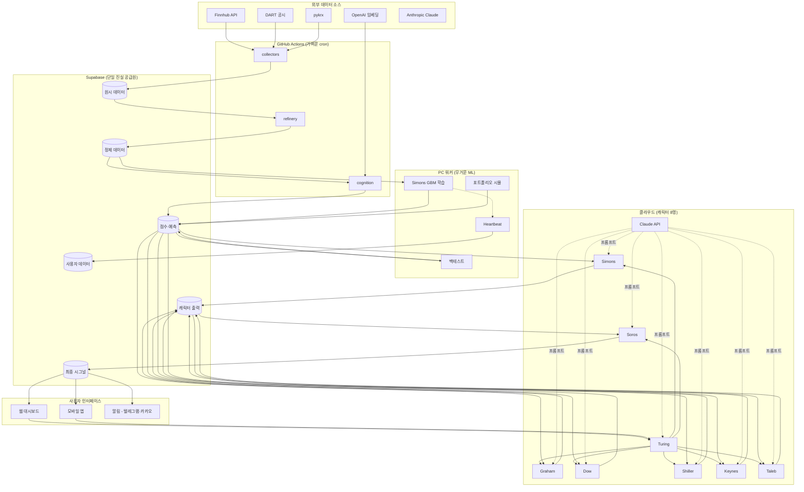

---

## 2. 레이어별 세부 다이어그램

시스템을 5개 레이어로 분리해서 각각 세부 흐름을 정의.

### 레이어 1: 수집 (Collection)

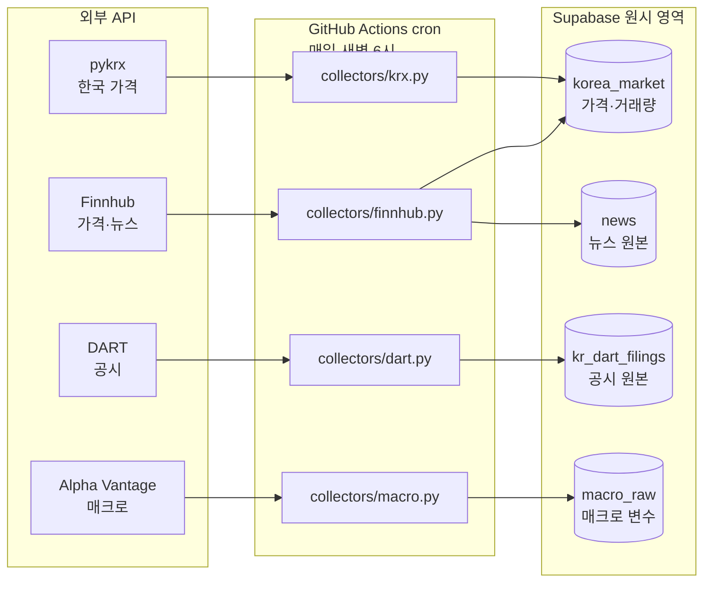

**특징**:
- 빈도: 매일 1회 (아침 6시)
- 실행 환경: GitHub Actions
- 멱등성: 같은 날짜 재실행 시 UPSERT로 중복 방지
- 실패 시: heartbeat 누락 → 알림

### 레이어 2: 정제 (Refinement)

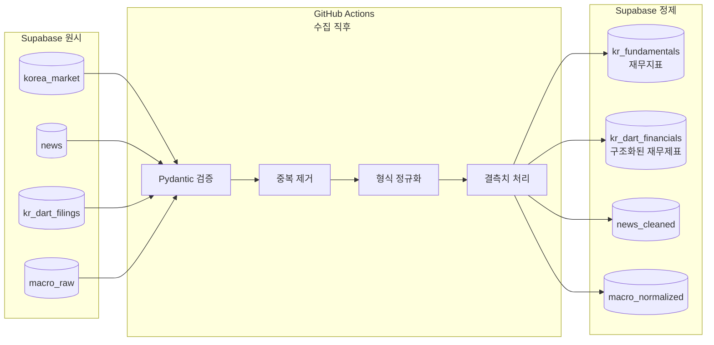

**특징**:
- 빈도: 수집 직후 자동
- 핵심 검증: Pydantic으로 타입·범위 체크
- 실패 데이터: `_quarantine` 테이블로 분리

### 레이어 3: 인지 (Cognition - LLM/임베딩)

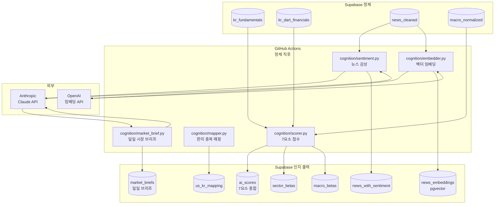

**특징**:
- 외부 API 호출 비용 발생 (OpenAI 임베딩 + Anthropic LLM)
- 캐싱: 같은 뉴스 재임베딩 안 함
- 출력: 점수·임베딩·브리프

### 레이어 4: 분석 (PC 워커 + 캐릭터)

PC 워커와 클라우드 캐릭터의 협력이 가장 복잡한 부분.

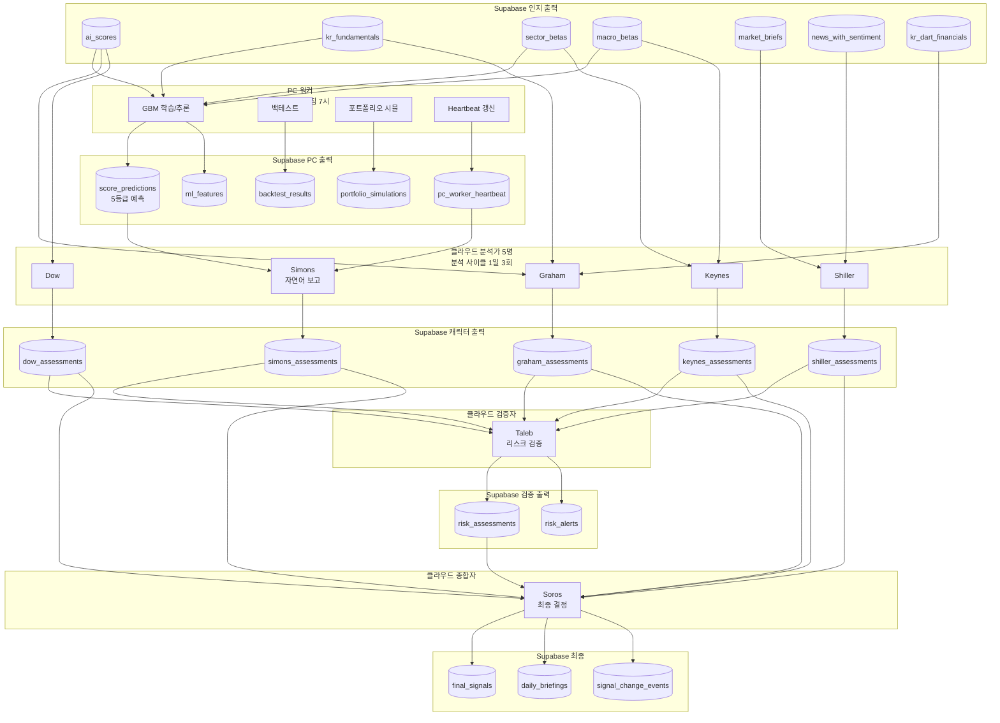

**특징**:
- PC 워커 출력 → 클라우드 캐릭터 입력 (비동기)
- Heartbeat 체크: Simons가 PC 데이터 신선도 평가
- Taleb은 *항상 마지막 분석가*: 다른 5명 출력 후 검증
- Soros는 *모든 출력을 합산*하는 종합자

### 레이어 5: 전달 (Delivery - UI/알림)

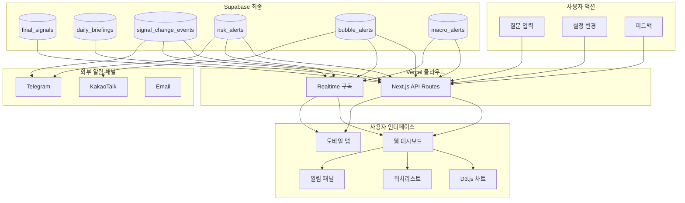

**특징**:
- API 라우트: 사용자 요청 처리
- Realtime: 시그널 변경 즉시 푸시
- 알림: 텔레그램·카카오 동시 발송 가능

---

## 3. 시간 축별 데이터 흐름

같은 시스템도 *언제 데이터가 흐르는지*에 따라 다르게 작동.

### 매일 (Daily Cycle)

```mermaid
gantt
    title 매일 데이터 흐름 타임라인
    dateFormat HH:mm
    axisFormat %H:%M
    
    section 수집·정제
    GitHub Actions 시작     :h1, 06:00, 30m
    collectors 실행         :h2, after h1, 20m
    refinery 실행           :h3, after h2, 15m
    cognition 실행          :h4, after h3, 25m
    
    section PC 워커
    PC heartbeat 시작       :m1, 07:00, 5m
    Simons GBM 추론         :m2, after m1, 30m
    포트폴리오 시뮬         :m3, after m2, 15m
    
    section 분석 사이클 1 - 아침
    분석가 5명 호출         :a1, 07:30, 5m
    Taleb 검증             :a2, after a1, 3m
    Soros 종합             :a3, after a2, 5m
    모닝 브리프 발행       :a4, after a3, 1m
    
    section 분석 사이클 2 - 점심
    분석 사이클 (간이)     :p1, 12:00, 10m
    
    section 분석 사이클 3 - 장마감
    분석 사이클 (간이)     :c1, 16:00, 10m
    
    section 알림 발송
    아침 알림              :n1, 07:35, 5m
    중요 변경 알림         :n2, 09:00, 5m
    장마감 알림            :n3, 16:30, 5m
```

### 매주 (Weekly Cycle)

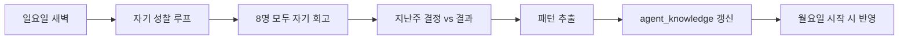

### 매월 (Monthly Cycle)

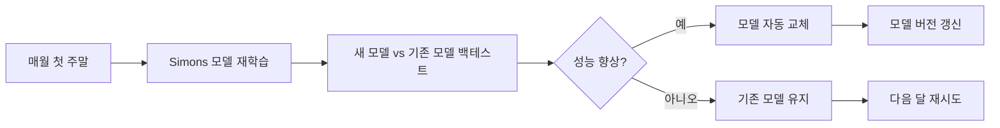

### 매 분기 (Quarterly Cycle)

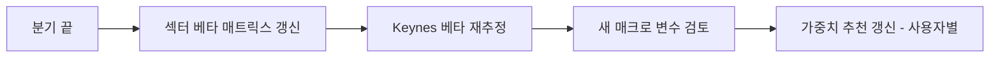

### 실시간 (Real-time Trigger)

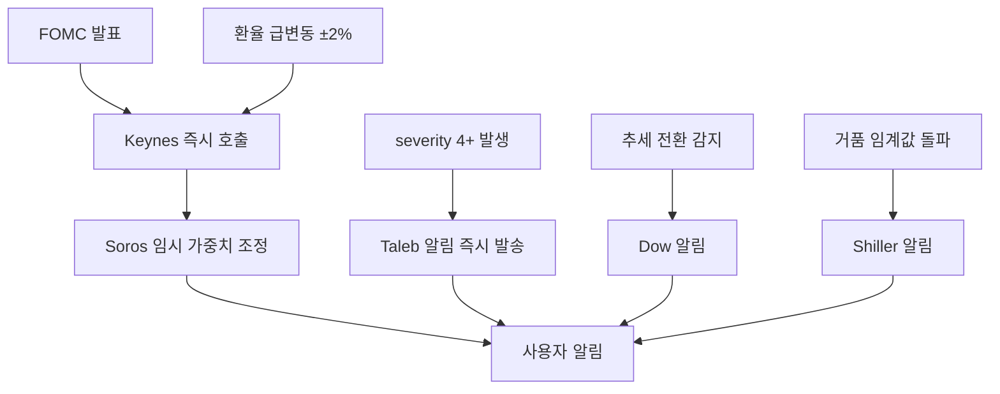

---

## 4. 사용자 액션이 데이터에 미치는 영향

사용자가 무언가 할 때 데이터가 어떻게 흐르는지 5가지 시나리오.

### 시나리오 A: 사용자가 종목을 워치리스트에 추가

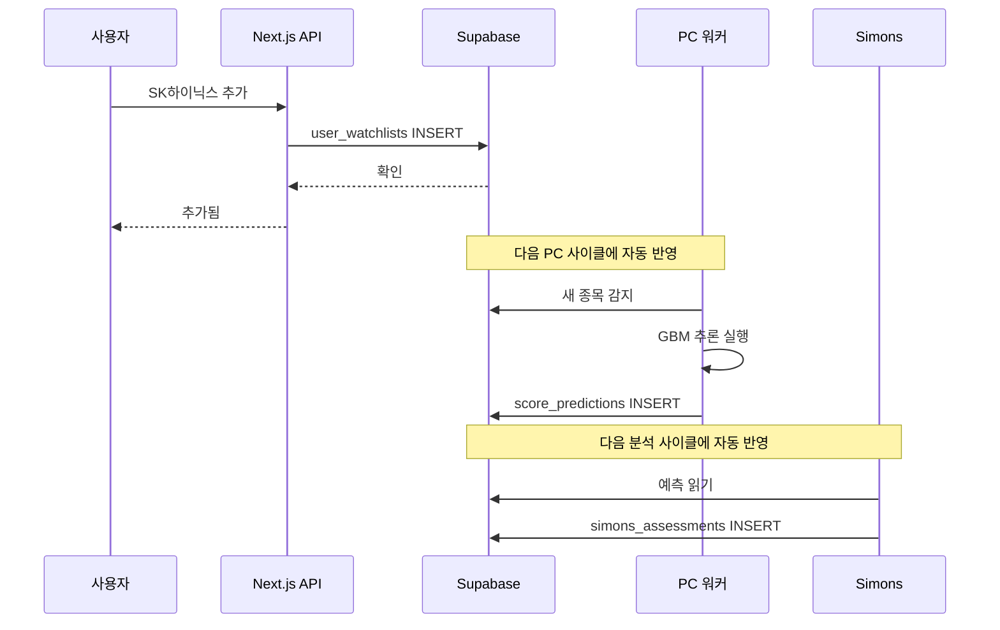

### 시나리오 B: 사용자가 가중치 변경

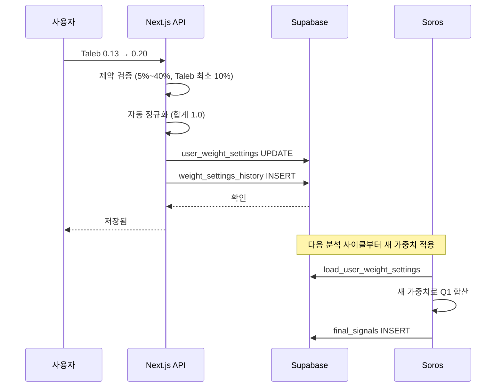

### 시나리오 C: 사용자가 질문 ("SK하이닉스 어때?")

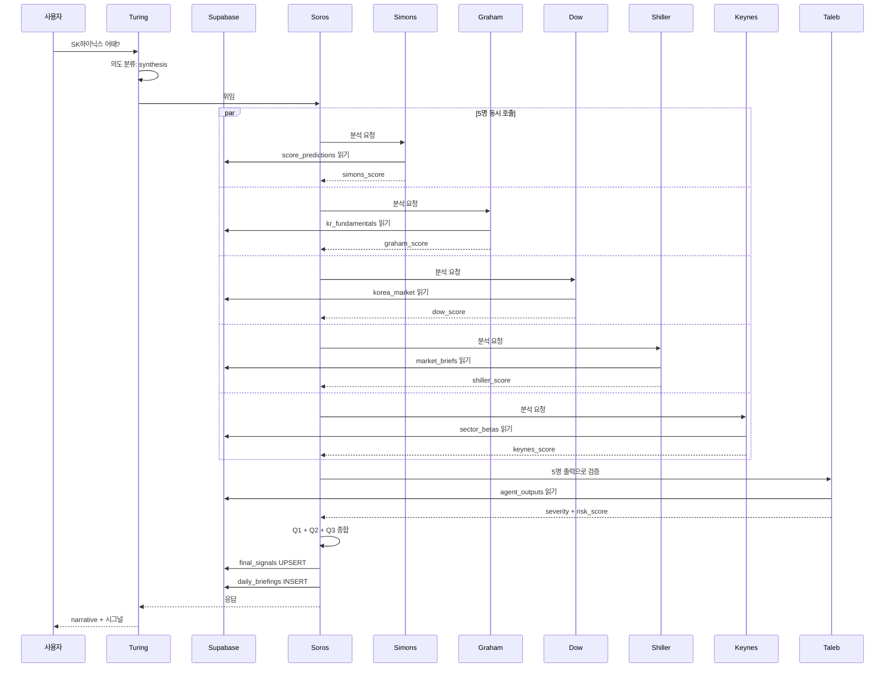

### 시나리오 D: 사용자가 피드백 (👎)

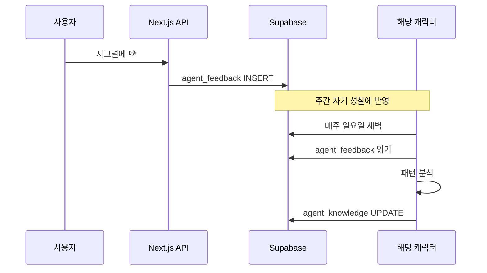

### 시나리오 E: 시장 이벤트 발생 (FOMC 발표)

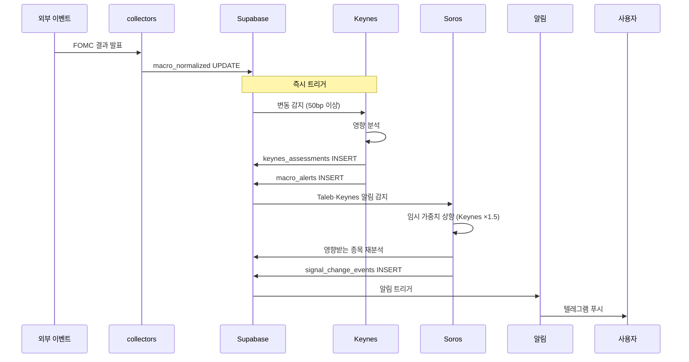

---

## 5. 데이터 보존 정책

| 데이터 종류 | 보존 기간 | 이유 |
|---|---|---|
| 원시 가격 (`korea_market`) | 영구 | 백테스트, 차트 표시 |
| 원시 뉴스 (`news`) | 5년 | 학습 데이터 |
| 원시 공시 (`kr_dart_filings`) | 영구 | 펀더멘털 추적 |
| 캐릭터 출력 (`*_assessments`) | 2년 | 자기 성찰, 강화 학습 |
| 시그널 (`final_signals`) | 영구 | 사용자 결정 추적 |
| 사용자 피드백 (`agent_feedback`) | 영구 | 학습 데이터 |
| 라우팅 로그 (`turing_routing_logs`) | 6개월 | 디스크 절약 |
| 임시 캐시 (`ml_features`) | 7일 | 재계산 가능 |

---

## 6. 장애 대응 흐름

각 컴포넌트 장애 시 시스템 동작.

### PC 워커 장애

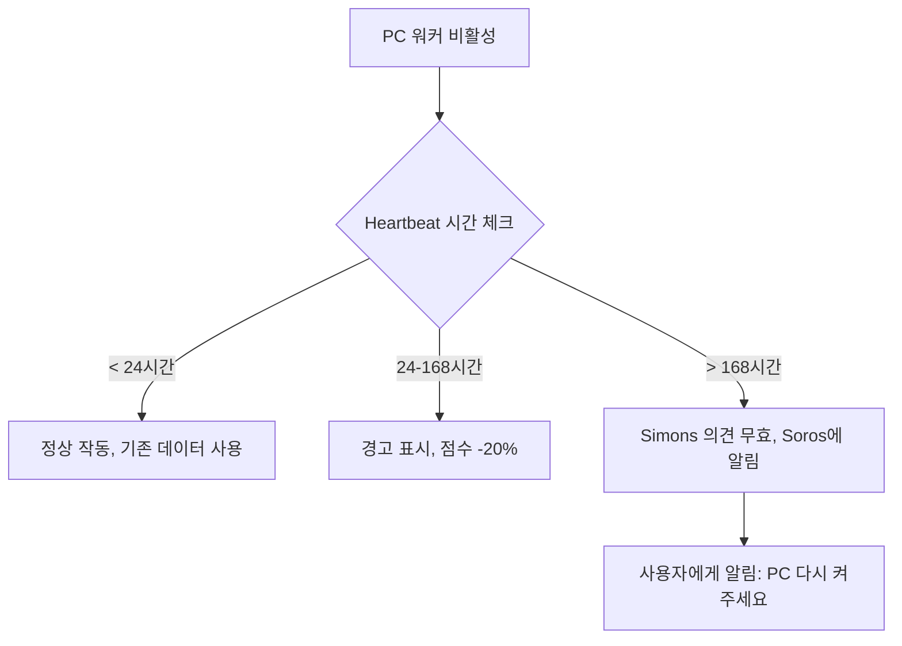

### GitHub Actions 장애

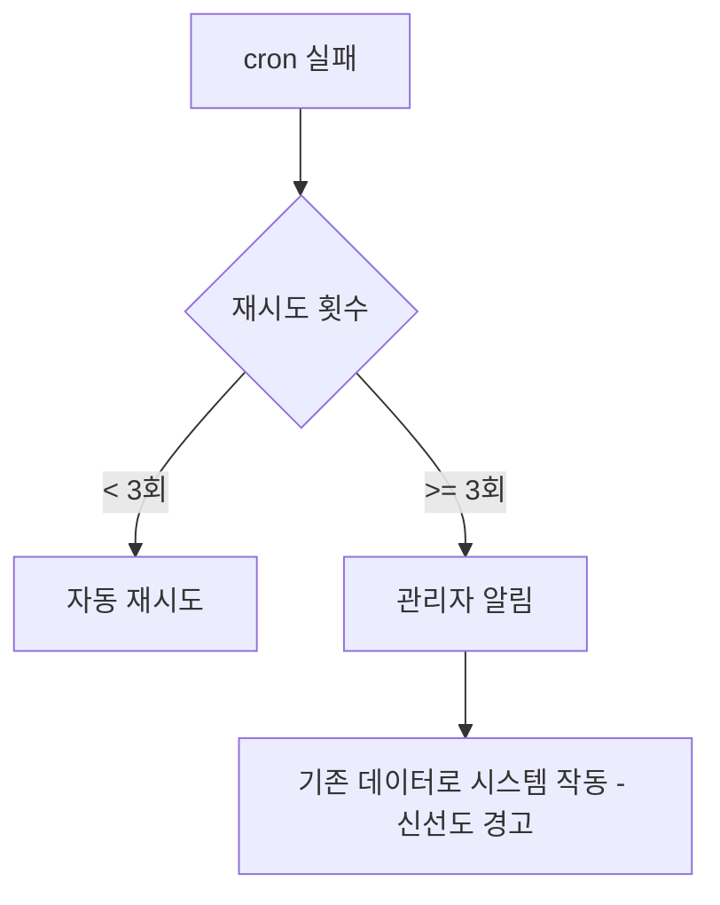

### Anthropic API 장애

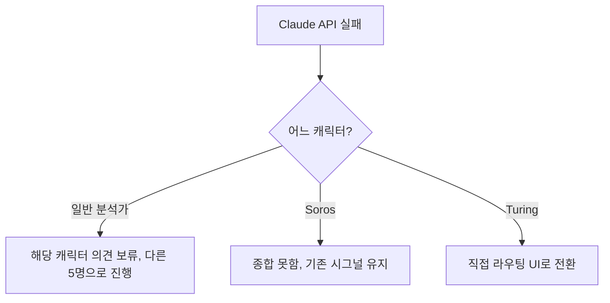

### Supabase 장애

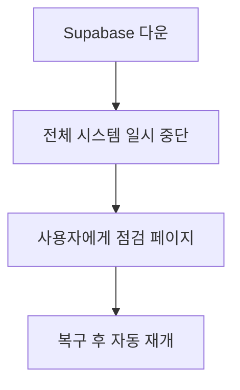

---

## 7. 데이터 정합성 체크 (매일)

매일 새벽 자동 실행되는 데이터 품질 체크.

```mermaid
graph LR
    CHK1[가격 데이터 누락 체크] --> R1[리포트]
    CHK2[7요소 점수 분포 체크] --> R1
    CHK3[캐릭터 출력 누락 체크] --> R1
    CHK4[시그널 변경 일관성 체크] --> R1
    CHK5[heartbeat 신선도 체크] --> R1
    
    R1 --> DEC{이상 감지?}
    DEC -->|예| ALERT[관리자 알림]
    DEC -->|아니오| OK[정상]
```

---

## 8. 데이터 흐름 디버깅 가이드

*"왜 이 시그널이 나왔지?"* 를 추적하는 표준 절차.

### 디버깅 7단계

```mermaid
graph TB
    Q[왜 이 시그널?] --> S1[1. final_signals 조회]
    S1 --> S2[2. cycle_id로 daily_briefings 조회]
    S2 --> S3[3. Soros의 Q1 합산 확인]
    S3 --> S4[4. 6명 캐릭터 출력 확인]
    S4 --> S5[5. 각 캐릭터의 입력 데이터 확인]
    S5 --> S6[6. 원시 데이터까지 추적]
    S6 --> S7[7. Taleb override 여부 확인]
    
    S7 --> A[근본 원인 발견]
```

### SQL 예시

```sql
-- 1. 최종 시그널
SELECT * FROM final_signals WHERE ticker = 'SK하이닉스' AND created_at::date = '2025-01-15';

-- 2. 그 cycle의 일일 브리프
SELECT * FROM daily_briefings WHERE briefing_date = '2025-01-15';

-- 3. 6명 캐릭터 출력 (cycle_id로)
SELECT * FROM agent_outputs WHERE cycle_id = 'xxx';

-- 4. Taleb 우려 (그 시점)
SELECT * FROM risk_assessments WHERE cycle_id = 'xxx';

-- 5. Soros의 가중치 (자유 조정 여부)
SELECT * FROM soros_weight_adjustments WHERE cycle_id = 'xxx';
```

---

## 9. 미해결 항목

- [ ] **PC 워커와 클라우드 동기화 빈도**: 현재 1일 1회. 실시간 필요한가?
- [ ] **Supabase Realtime 구독 범위**: 어떤 테이블 변경을 즉시 푸시?
- [ ] **데이터 보존 정책 자동화**: 보존 기간 지난 데이터 자동 삭제?
- [ ] **백업 전략**: Supabase 자체 백업 외 추가 백업?
- [ ] **장애 시 그레이스풀 디그라데이션**: 일부 장애 시 부분 작동 정의 더 필요

---

**다음 단계: 호출 흐름 정의서 (사용자 대화 시나리오)**
