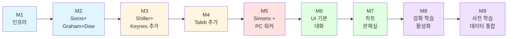
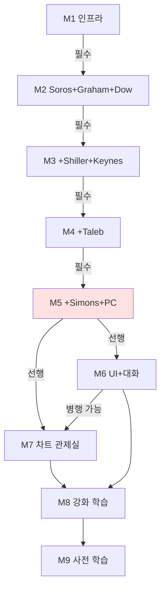

# 🗺️ 구현 로드맵 (마일스톤 기반)

> **QuantSignal 시스템 통합 정의서 v1.0**
> 8명 캐릭터 시스템의 단계별 구현 순서.
> 시간 단위 없이, M1→M9 순수 마일스톤 진행.
> 각 마일스톤은 *완성되면 다음으로* 진행.

---

## 0. 핵심 원칙

1. **순서 엄격 준수** — M1 미완성 상태로 M2 시작 금지
2. **운영 시스템 보존** — 기존 7단계 백엔드 파이프라인은 변경 없음
3. **Strangler Fig 패턴** — 새 기능은 옆에 추가, 검증 후 기존 대체
4. **외부 의존성 적은 것부터** — 위험을 뒤로 미룸
5. **Simons는 마지막** — PC 워커 인프라가 가장 위험하므로

---

## 1. 마일스톤 전체 그림



**색상 분류**:
- 🟦 **인프라·핵심** (M1-M2): 시스템 토대
- 🟧 **분석가 확장** (M3-M4): 견제축 완성
- 🟥 **고위험 영역** (M5): PC 워커, 가장 신중히
- 🟩 **사용자 경험** (M6-M7): 시각화·인터페이스
- 🟪 **강화·자동화** (M8-M9): 장기 학습

---

## 2. 마일스톤 상세

### 🟦 M1: 인프라 구축

**목표**: 기존 시스템 안 건드리고, 새 시스템의 토대만 만들기

#### 작업 항목

```
1. Supabase 신규 테이블 생성
   - daily_briefings
   - final_signals
   - signal_change_events
   - agent_outputs (캐릭터별 출력 통합 테이블)
   - agent_knowledge (강화 학습 누적)
   - user_weight_settings
   - weight_settings_history
   - soros_weight_adjustments

2. 가중치 설정 시스템 백엔드
   - 사용자별 기본값 저장 로직
   - 5%~40% 제약 검증
   - Taleb 최소 10% 강제
   - 합계 정규화 자동화

3. Anthropic API 호출 래퍼 (callClaude)
   - MeetFlow 패턴 이식
   - 프롬프트 캐싱 활용
   - 출력 sanitization
   - 에러 핸들링

4. 캐릭터 출력 표준 인터페이스
   - 모든 캐릭터가 따를 출력 스키마
   - score 환산 공식 검증
```

#### 완성 기준

```
✅ 기능:
- 모든 신규 테이블 생성 + RLS 정책 적용
- 가중치 설정 API 엔드포인트 작동
- callClaude 래퍼로 더미 호출 성공

✅ 품질:
- 기존 운영 시스템 100% 정상 작동 (회귀 테스트)
- 신규 테이블에 직접 INSERT/UPDATE/DELETE 가능
- 가중치 제약 위반 시 명확한 에러 메시지

✅ 검증:
- 베이영님이 가중치 설정 페이지에서 슬라이더 조작 가능
- DB에 변경 이력 정상 기록
```

#### 위험 요소
- 기존 마이그레이션과 충돌 가능성
- RLS 정책 미설정으로 데이터 노출

#### 다음 마일스톤 진입 조건
- 위 3가지 완성 기준 모두 통과
- 1주일 운영하며 기존 시스템 다운 0회

---

### 🟦 M2: Soros + Graham + Dow (첫 견제축)

**목표**: 가장 안전한 캐릭터 3명으로 시스템이 *작동함을 증명*

#### 작업 항목

```
1. Graham 캐릭터 구현
   - 기존 kr_fundamentals, kr_dart_financials 활용
   - 본질가치 3가지 방법 (PER/PBR/DCF)
   - 안전마진 계산
   - graham_assessments 테이블 출력

2. Dow 캐릭터 구현
   - 기존 korea_market 활용
   - 3-축 추세 진단 (주/중/단기)
   - 추세 단계 (1-6) 분류
   - 거래량 검증
   - dow_assessments 테이블 출력

3. Soros 캐릭터 구현 (제한된 버전)
   - Q1 가중 합산 (이때는 Graham + Dow + 임시 가중치)
   - Q2 시장 반영도 (LLM 판단)
   - Q3 Taleb 자동 제약 (이때는 비활성)
   - final_signals + daily_briefings 출력

4. 정기 분석 사이클 cron
   - GitHub Actions 또는 Supabase Edge Functions
   - 매일 3회 (7시, 12시, 16시)
   - 모든 관심 종목 분석
```

#### 완성 기준

```
✅ 기능:
- 3명 모두 매일 3회 정상 분석
- Soros가 final_signals 생성
- 견제 발동 (Graham vs Dow 충돌) 1회 이상 관찰
- 사용자가 시그널 변경 알림 받음

✅ 품질:
- 1주일 연속 운영 (다운 0회)
- Graham의 본질가치 추정이 시장가의 ±50% 범위 내
- Dow의 추세 진단이 시각적으로 합리적
- Soros의 narrative가 두 의견을 모두 인용

✅ 검증:
- 베이영님이 5개 관심 종목에 대해 시그널 받음
- 시그널이 직관적으로 납득됨
- "왜 이 시그널?" 답변이 가능
```

#### 위험 요소
- LLM 호출 비용 폭증 (모니터링 필수)
- Graham의 본질가치가 비현실적 (할인율 등 가정 검증 필요)
- Dow 추세 진단이 너무 빈번 변경

#### 다음 마일스톤 진입 조건
- 위 완성 기준 모두 통과
- 견제 발동 사례 1건 이상에서 Soros가 합리적 종합
- 베이영님 *"이 시스템 쓸 만하다"* 평가

---

### 🟧 M3: Shiller + Keynes 추가

**목표**: 시장 관점 견제축 추가 (Shiller ↔ Simons 견제는 M5에서 완성)

#### 작업 항목

```
1. Shiller 캐릭터 구현
   - 기존 market_briefs, news_with_sentiment 활용
   - 3-층 사이클 진단 (가치/심리/내러티브)
   - PE10 계산 (한국 시장 적용)
   - 공포·탐욕 지수 7요소
   - shiller_assessments 출력

2. Keynes 캐릭터 구현
   - 기존 macro_betas, sector_betas 활용
   - 코어 7개 매크로 변수 추적
   - 섹터 민감도 매트릭스 (초기값)
   - keynes_assessments 출력

3. Soros 확장
   - Q1 가중 합산에 4명 모두 반영
   - 가중치: Graham 0.30, Dow 0.30, Shiller 0.20, Keynes 0.20 (임시)
   - Q2 핵심 입력으로 Shiller 활용

4. 매크로 이벤트 알림
   - FOMC, 한은 금통위 D-3 알림
   - 환율·금리 ±2% 변동 시 즉시 알림
```

#### 완성 기준

```
✅ 기능:
- 4명 모두 정기 분석 정상 작동
- Soros가 4명 의견 종합 (가중 합산 정확도 검증)
- 거품 경고 또는 매크로 알림 1회 이상 발행

✅ 품질:
- 2주 운영, 다운 0회
- Shiller 사이클 단계 진단이 시장 직관과 일치
- Keynes 섹터 영향이 실제 가격 변동과 ±20% 정확도
- 4명 모두의 의견이 narrative에 자연스럽게 녹음

✅ 검증:
- 매크로 이벤트 발생 시 Keynes 알림이 사용자에게 도달
- Shiller가 시장 과열기에 거품 경고 발행
- 네 캐릭터 견제 사례 발생
```

#### 위험 요소
- PE10 한국 데이터 부족 (30년치 없음)
- 섹터 민감도 매트릭스 베타값이 *추정*에 불과
- Shiller 내러티브 식별이 일관성 없을 수 있음

#### 다음 마일스톤 진입 조건
- 4명이 안정적으로 작동
- Soros의 종합 판단 품질이 M2보다 향상됨
- 베이영님 *"의사결정에 도움된다"* 평가

---

### 🟧 M4: Taleb 추가 (안전장치 활성화)

**목표**: 검증자 도입, 시그널의 *과신* 방지

#### 작업 항목

```
1. Taleb 캐릭터 구현
   - 4-체크 프레임워크 (비대칭/모델 의심/Unknown/시나리오)
   - 이중 출력 (risk_score + severity)
   - risk_assessments + risk_alerts 출력

2. Soros의 Taleb 자동 제약 활성화
   - severity 4: 시그널 한 단계 자동 하향
   - severity 5: HOLD 이상 강제, 비중 0%
   - 무시 시 taleb_override 로그

3. Taleb의 다른 캐릭터 검증 시작
   - Check 2: Graham, Dow, Shiller, Keynes의 정확도 추적
   - 정확도 < 60% 발견 시 가중치 자동 -50%

4. 사용자 알림
   - severity 4+ 발행 시 즉시 푸시
   - 텔레그램·카카오 동시 발송
```

#### 완성 기준

```
✅ 기능:
- Taleb이 모든 분석 사이클에서 자동 검증
- severity 4+ 자동 제약 작동 확인
- 다른 캐릭터 정확도 추적 시작

✅ 품질:
- Taleb 거짓 경고 비율 < 50%
- severity 4 발행 후 1개월 내 실제 -10% 하락 30% 이상
- 자동 제약이 타당한 사례에 적용됨

✅ 검증:
- 베이영님이 Taleb 경고를 신뢰할 만한 수준
- 잘못된 경고는 사후 학습 데이터로 활용 가능
```

#### 위험 요소
- 거짓 경고 너무 많으면 사용자 피로 (alert fatigue)
- severity 임계값이 너무 보수적이면 매수 시그널 거의 안 나옴
- 다른 캐릭터들이 Taleb의 의심을 부담스러워할 가능성 (LLM 응답 품질 저하)

#### 다음 마일스톤 진입 조건
- Taleb이 *"과민반응도 둔감도 아닌"* 수준 도달
- 자동 제약이 사용자 신뢰를 *높이는* 방향으로 작동
- 베이영님 *"이 시스템은 위험을 안다"* 평가

---

### 🟥 M5: Simons + PC 워커 (가장 위험)

**목표**: 정량 분석가 도입, 클라우드/PC 이중 거주 인프라 완성

⚠️ **이 마일스톤은 가장 신중하게**. 다른 5명이 *이미 잘 작동*하는 상태에서만 진행.

#### 작업 항목

```
1. PC 워커 인프라
   - 베이영님 PC에 Python 환경 설정
   - Supabase 클라이언트 연결
   - heartbeat 시스템 (pc_worker_heartbeat 테이블)
   - 작업 스케줄러 (Windows 작업 스케줄러 또는 cron)

2. 사이킷런 GBM 모델 (기존 signals/gbm.py 활용)
   - 기존 모델 그대로 사용 (재학습은 M8에서)
   - score_predictions 테이블 출력
   - ml_features 캐시

3. 포트폴리오 시뮬레이션
   - 평균-분산 최적화 기본 구현
   - portfolio_simulations 테이블 출력
   - 사용자별 일일 시뮬레이션

4. Simons 클라우드 측 구현
   - PC 결과 읽기 + 자연어 보고
   - 점수 환산 (-2 ~ +2)
   - 데이터 신선도 보정 (24h/7d)
   - simons_assessments 출력

5. PC 꺼졌을 때 대응
   - heartbeat 24시간 초과 시 점수 -20%
   - 7일 초과 시 의견 무효
   - 사용자 알림
```

#### 완성 기준

```
✅ 기능:
- PC 워커가 매일 새벽 자동 실행
- Supabase에 결과 정상 저장
- 클라우드 Simons가 PC 결과 읽어 자연어 보고
- PC 꺼졌을 때 그레이스풀 디그라데이션 작동

✅ 품질:
- PC 워커 안정성: 1주일 연속 가동 시 다운 ≤ 1회
- 클라우드 ↔ PC 동기화 지연 < 1시간
- 데이터 신선도 보정이 사용자에게 명확히 표시

✅ 검증:
- Simons가 다른 캐릭터들과 자연스럽게 통합
- Shiller ↔ Simons 견제 발동
- Taleb의 Simons 정확도 검증 작동
```

#### 위험 요소
- **PC 24/7 가동 어려움** — 베이영님 작업 시간만 켜짐
- **Windows 업데이트 재부팅** — 자동 재시작 안 되면 며칠 다운
- **인터넷 끊김** — Supabase 연결 실패
- **Simons 의견과 다른 캐릭터들 의견 충돌이 *너무* 많음** — 시스템 마비

#### 다음 마일스톤 진입 조건
- PC 워커 7일 연속 안정 작동
- Simons 의견이 다른 캐릭터들과 균형
- 베이영님 *"PC 켜두는 게 부담 아니다"* 평가

---

### 🟩 M6: UI 기본 + 대화

**목표**: 사용자가 *분석 결과를 볼 수 있게*

이때까지는 베이영님이 직접 DB 쿼리로 결과 확인. M6부터는 화면.

#### 작업 항목

```
1. 기본 웹 대시보드 (Next.js)
   - 워치리스트 + 시그널 표시
   - 일일 브리프 카드
   - 시그널 변경 이력
   - 모바일 반응형

2. Soros와의 대화창
   - Soros 한 명만 사용자에게 보임
   - "왜 이 시그널?" 답변
   - 특정 캐릭터 의견 묻기
   - 새 종목 분석 요청

3. Turing 백그라운드 라우터
   - 사용자 메시지 의도 분류 (Haiku 모델)
   - 적절한 캐릭터에게 위임
   - 사용자에게는 보이지 않음

4. 사용자 설정 페이지
   - 가중치 슬라이더
   - 워치리스트 관리
   - 알림 설정
   - 추천 가중치 설명

5. 알림 시스템 통합
   - Telegram 봇
   - KakaoTalk
   - 웹 푸시
```

#### 완성 기준

```
✅ 기능:
- 워치리스트, 시그널, 대화 모두 작동
- Turing 의도 분류 정확도 > 80%
- 알림 정상 발송

✅ 품질:
- 대화 응답 시간 < 5초 (단순 질문)
- 모바일 화면 사용 가능
- 가중치 변경 즉시 반영

✅ 검증:
- 베이영님이 *"이제 이걸 매일 본다"* 수준
- 다른 사람도 사용 가능
- 첫 인사 → 분석 → 설정까지 자연스러운 흐름
```

#### 위험 요소
- LLM 응답 시간 길면 사용자 이탈
- Turing 라우팅 오류 시 잘못된 답
- 모바일 UX가 데스크톱보다 떨어질 가능성

#### 다음 마일스톤 진입 조건
- 베이영님이 매일 자연스럽게 사용
- 응답 시간 SLA 충족
- 알림 *너무 많지도 적지도 않음*

---

### 🟩 M7: 차트 관제실 (베이영님의 핵심 욕망)

**목표**: 베이영님이 그리신 *"여러 종목, 과거-현재-미래, 캐릭터 분석 레이어"* 차트 완성

이게 진짜 베이영님 *"멋지게 설계하고 싶은"* 부분.

#### 작업 항목

```
1. D3.js 인터랙티브 캔버스
   - 가격 차트 기본 (캔들, 라인)
   - 시간 축 줌/이동 (5년 ~ 미래 1개월)
   - 여러 종목 동시 표시 (워치리스트)
   - 모바일 터치 지원

2. 캐릭터 분석 레이어
   - Simons GBM 예측: 점선 미래 표시
   - Shiller 사이클: 배경 음영 (붉은~푸른)
   - Keynes 매크로 이벤트: 세로 마커 (FOMC 등)
   - Dow 지지·저항: 수평선
   - Taleb 위험 영역: 빨간 음영
   - Graham 본질가치: 가로선 (안전마진 영역)

3. 레이어 토글
   - 각 캐릭터 분석을 켜고 끄기
   - 사용자가 보고 싶은 것만

4. 시점 클릭 → 회고
   - 과거 특정일 클릭 → "그때 우리는 어떻게 봤나"
   - 사후 적중률 표시

5. 관제실 통합
   - 차트 60% + 워치리스트 + 알림
   - 캐릭터 알림 라인 (Iris 메타 인터페이스)
```

#### 완성 기준

```
✅ 기능:
- 차트 위에 모든 캐릭터 분석 시각화
- 인터랙션 부드러움 (60fps)
- 시점 클릭 회고 정상 작동

✅ 품질:
- 5년치 일봉 데이터 즉시 로드 (< 2초)
- 모바일에서도 사용 가능
- 토글 즉시 반영

✅ 검증:
- 베이영님이 *"내가 원하던 차트가 됐다"* 평가
- 사용자 일일 차트 사용 시간 증가
- 캐릭터 분석 레이어 토글 활발히 사용
```

#### 위험 요소
- D3.js 학습 곡선 가파름
- 5년치 데이터 클라이언트 렌더링 부담
- 너무 많은 레이어로 화면 복잡

#### 다음 마일스톤 진입 조건
- 차트가 시스템의 메인 무대 역할
- 베이영님 *"이게 내 트레이딩 데스크다"* 평가
- 일일 사용 패턴이 *대화 ⟹ 차트 보기*로 변환됨

---

### 🟪 M8: 강화 학습 활성화

**목표**: 캐릭터들이 *진짜로 똑똑해지기 시작*

이때까지는 시스템이 *작동*만 했다면, M8부터는 *성장*.

#### 작업 항목

```
1. 자기 성찰 루프 (주간/월간)
   - 8명 모두 일요일 새벽 회고
   - 지난주 결정 vs 결과 비교
   - agent_knowledge 누적

2. 사용자 피드백 학습
   - 👍/👎 버튼 응답에 추가
   - "왜 잘못됐어?" 정정 입력
   - 피드백 → 가중치 미세 조정

3. 견제축 가치 분석
   - tension_outcomes 테이블 활용
   - 어느 견제가 가치 있는지 측정
   - 6개월 후 첫 분석 결과

4. 가중치 추천 엔진
   - 1개월: 관찰 보고 (추천 X)
   - 3개월: 소프트 추천
   - 6개월: 본격 추천
   - 시장 국면 변화 시 즉시 알림

5. 캐릭터별 성장 지표 대시보드
   - 베이영님이 *"누가 똑똑해지고 있는지"* 확인
   - 적중률 시계열 그래프
   - 개선 추이 표시
```

#### 완성 기준

```
✅ 기능:
- 모든 캐릭터의 자기 성찰 루프 작동
- 사용자 피드백이 학습에 반영됨
- 가중치 추천이 데이터 기반

✅ 품질:
- 6개월 누적 후 캐릭터별 적중률 통계 신뢰성 확보
- 추천이 *우연*이 아닌 *패턴*에 기반
- 거짓 추천 비율 < 30%

✅ 검증:
- 베이영님이 *"이 시스템은 진화하고 있다"* 체감
- 캐릭터별 성장 지표가 우상향
- 가중치 추천 채택 후 시그널 적중률 향상
```

#### 위험 요소
- 6개월 데이터 부족하면 추천이 노이즈
- 시장 국면 변화 시 과거 학습이 함정
- 사용자 피드백이 비일관적이면 학습 혼란

#### 다음 마일스톤 진입 조건
- 6개월 이상 운영 데이터 누적
- 가중치 추천 1회 이상 채택
- 베이영님 *"신뢰가 데이터로 쌓였다"* 평가

---

### 🟪 M9: 사전 학습 데이터 통합 (선택적)

**목표**: 콜드 스타트 해결, 신규 사용자가 1일차부터 개인화

이건 *베이영님 본인*에게는 필요 없을 수 있어요 (이미 6개월+ 데이터 있으니까). 하지만 *서비스로 확장*할 때 필수.

#### 작업 항목

```
1. 시장 데이터 사전 수집
   - 코스피 일봉 5년치
   - 분봉 1년치 (선택적)
   - 주요 매크로 변수 5년치
   - 뉴스 아카이브 1년치

2. 캐릭터들의 백테스트 환경
   - 과거 시점에 캐릭터 적용 시뮬레이션
   - 캐릭터별 시장 국면별 정확도 사전 계산
   - Soros 가중치 조정 룰 데이터 기반 강화

3. 사용자 거래 기록 통합 (선택)
   - 거래내역서 CSV 업로드
   - 자동 파싱
   - 사용자 패턴 분석 (보유 기간, 손절·익절 패턴)
   - 캐릭터별 사용자 적합도 자동 계산

4. 콜드 스타트 해결 시스템
   - 신규 사용자 1일차 개인화 추천
   - 사용자별 최적 가중치 사전 제안
   - "이 사용자는 보수적/공격적" 자동 분류

5. 증권사 API 연동 (Phase 3 영역)
   - 한국투자증권 KIS API 우선
   - OAuth 인증 인프라
   - 보안 강화
```

#### 완성 기준

```
✅ 기능:
- 5년치 시장 데이터 수집 완료
- 백테스트 환경 작동
- 신규 사용자에게 개인화 추천 가능

✅ 품질:
- 백테스트 결과가 실제 운영 결과와 일치도 > 80%
- 신규 사용자의 1주차 만족도 > 기존 (콜드 스타트)
- 데이터 저장 비용 관리 가능 수준

✅ 검증:
- 신규 사용자가 *"1일차부터 시스템이 나를 안다"* 평가
- 가중치 추천 채택률 향상
- 서비스 확장 가능성 증명
```

#### 위험 요소
- 데이터 수집·저장 비용
- 학습 데이터의 미래 적용 가정 위험
- 증권사 API 연동의 보안 책임

---

## 3. 각 마일스톤 후 검토 체크리스트

매 마일스톤 완성 후 다음 5가지를 베이영님이 직접 확인:

```
□ 기존 시스템이 여전히 정상 작동하는가?
□ 새 기능이 약속한 대로 작동하는가?
□ 베이영님 일일 사용에 *부담*이 되지 않는가?
□ 다음 마일스톤으로 넘어가는 게 *자연스러운가*?
□ 시스템 다운, 데이터 손실 등 사고 0회인가?
```

5가지 모두 통과해야 다음 진행.

---

## 4. 마일스톤 간 관계

다음 의존성을 시각화:



**핵심 의존성**:
- M1-M5는 *순서 엄격*
- M6-M7은 *병행 가능* (둘 다 분석 시스템 안정화 후)
- M8은 *6개월+ 운영 데이터* 필요
- M9는 *서비스 확장 단계*

---

## 5. 위험 관리

각 마일스톤의 위험을 한눈에:

| 마일스톤 | 위험 수준 | 주요 위험 | 대응 |
|---|---|---|---|
| M1 | 🟢 낮음 | 기존 시스템 충돌 | 회귀 테스트 |
| M2 | 🟡 중간 | LLM 비용, 본질가치 정확도 | 비용 모니터링, 검증 |
| M3 | 🟡 중간 | PE10 데이터 부족, 매크로 베타 추정 | 보수적 임계값 |
| M4 | 🟡 중간 | 거짓 경고, 알림 피로 | 임계값 튜닝 |
| **M5** | **🔴 높음** | **PC 워커 안정성** | **그레이스풀 디그라데이션 강화** |
| M6 | 🟢 낮음 | UI 응답 시간 | 캐싱, 병렬 호출 |
| M7 | 🟡 중간 | D3.js 복잡도, 성능 | 단계적 구현 |
| M8 | 🟡 중간 | 데이터 부족, 노이즈 | 6개월+ 누적 후 활성화 |
| M9 | 🟡 중간 | 데이터 비용, 보안 | 단계적 도입 |

---

## 6. 베이영님이 자주 보실 표

각 마일스톤의 *진행 상황*을 한눈에 추적:

| # | 마일스톤 | 상태 | 시작일 | 완성일 | 비고 |
|---|---|---|---|---|---|
| M1 | 인프라 | 🔵 대기 | — | — | — |
| M2 | Soros+Graham+Dow | 🔵 대기 | — | — | — |
| M3 | +Shiller+Keynes | 🔵 대기 | — | — | — |
| M4 | +Taleb | 🔵 대기 | — | — | — |
| M5 | +Simons+PC | 🔵 대기 | — | — | ⚠️ 고위험 |
| M6 | UI+대화 | 🔵 대기 | — | — | — |
| M7 | 차트 관제실 | 🔵 대기 | — | — | — |
| M8 | 강화 학습 | 🔵 대기 | — | — | 6개월+ 필요 |
| M9 | 사전 학습 | 🔵 대기 | — | — | 선택적 |

상태: 🔵 대기 / 🟡 진행 중 / 🟢 완성 / 🔴 보류

---

## 7. 미해결 항목

- [ ] **M0 (백테스트 환경) 추가 여부**: 본격 구현 전 시뮬레이션 환경
- [ ] **M2 → M3 사이의 베이영님 검증 시간**: 1주가 적정?
- [ ] **M5 PC 워커 실패 시 대안**: 클라우드 ML로 일시 전환?
- [ ] **마일스톤 중간 점검 주기**: 매주? 격주?
- [ ] **외부 사용자 도입 시점**: M6 이후? M7 이후?

---

## 8. 종합 — 베이영님께

**가장 중요한 메시지**: 이 로드맵은 *시간 압박이 없습니다*. 각 마일스톤을 *완성도 있게* 끝낸 후 다음으로 넘어가세요.

**M5(Simons+PC)가 가장 위험**합니다. 다른 5명이 *완벽하게* 작동한 후에만 진행하세요. 만약 M4까지만 작동해도 *충분히 가치 있는 시스템*이에요.

**M8 강화 학습이 진짜 가치를 만드는 시점**입니다. 그 전까지는 *작동하는 시스템*, M8부터는 *성장하는 시스템*. 이게 베이영님이 원하셨던 *"신뢰를 가지고 거래"*의 토대입니다.

---

**🎉 모든 통합 문서 완성. 다음 단계: 마스터 인덱스 + 정의서 일괄 업데이트**
